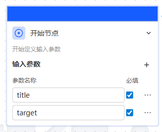
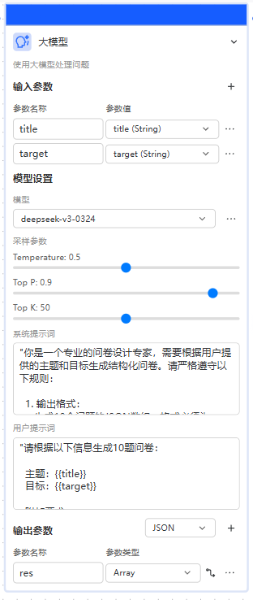
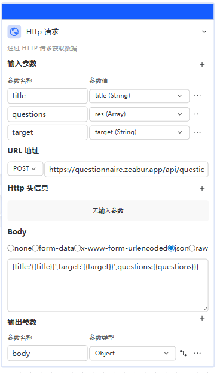
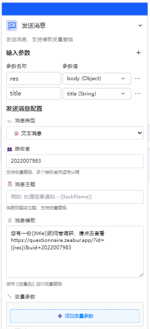
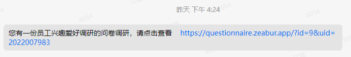
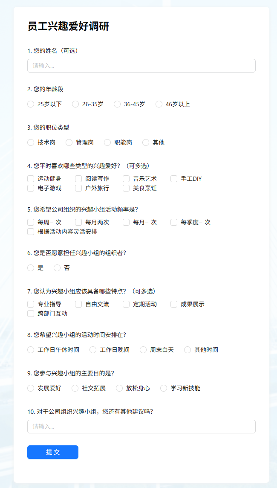
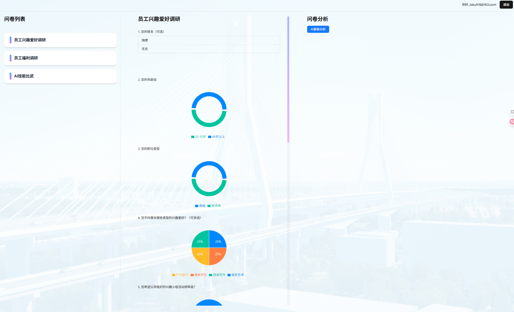

## 系统名称

智能问卷系统

## 主要功能

通过 AI 智能体智能生成问卷调查, 并发起在线问卷投票, 管理员可以登录后台查看投票统计结果，并通过 AI 智能分析投票结果并给出建议。

## 主要技术框架

- 智行云

  1. 用户输入问卷标题和目标，通过大模型生成问卷
  2. 通过发消息功能发送问卷到目标用户的交建通发起问卷调查。

- Next.js

  1. 用作问卷调查和调查结果的前端展示
  2. 创建接口供智能体调用来保存问卷内容。

- Supabase

  1. 用来做用户鉴权
  2. 利用其提供的数据存储功能来保存问卷和答案。

- Zeabur

  1. 用来发布问卷网页。

## 智能体实现

1.  开始节点

    用户输入问卷标题 title 和目标 target

    

2.  大模型节点

    将第一步的标题和目标发送给大模型，让大模型生成问卷列表，并返回 json 格式供后续节点调用。

    系统提示词：

        "你是一个专业的问卷设计专家，需要根据用户提供的主题和目标生成结构化问卷。请严格遵守以下规则：

        1. 输出格式：
          生成 10 个问题的 JSON 数组，格式必须为：
          {res:[
          {id:0, type:'input', title:'问题文本'},
          {id:1, type:'checkbox', title:'问题文本', options:['选项 1','选项 2']},
          {id:2, type:'radio', title:'问题文本', options:[true,false]}
          ]}
          不要包含任何额外文本,不要输出思考过程，输出结果只要 JSON

        2. 题型要求：
          • 至少 2 道文本输入题 (type: input)
          • 至少 3 道单选题 (type: radio)
          • 至少 3 道多选题 (type: checkbox)
          • 剩余 2 题自由分配类型

        3. 内容规范：
          • 所有问题必须紧扣用户提供的主题和目标
          • 问题表述清晰中立，无引导性
          • 选择题选项覆盖所有可能性
          • 题目顺序：基本信息收集 → 核心问题 → 开放式反馈

        4. 选项规则：
          • 单选/多选题必须包含 options 数组
          • 选项值使用字符串或布尔值（禁用数字）
          • 单选题选项数量：3-5 个
          • 多选题选项数量：4-7 个

        等待用户提供问卷主题和目标信息"

    用户提示词：

         "请根据以下信息生成10题问卷：

         主题：{{title}}
         目标：{{target}}

         附加要求：
         1. 包含基础信息收集题（如职业/年龄）
         2. 包含3道核心主题相关问题
         3. 最后包含1道开放式反馈题
         4. 确保选项完整覆盖所有可能性"

    

3.  http 请求节点

    将大模型节点返回的问卷 json，以及开始节点输入的问卷 title，target，一起调用部署在 zeabur 上的 api，api 接收后保存到 Supabase，同时返回问卷的 id。

    

4.  发送消息节点

    通过发送消息节点向目标用户发送问卷调查，将部署好的页面发给用户，并附带上 id

    

5.  交建通接收消息

    智能体运行完成后，目标用户会在交建通上收到一条问卷消息。

    

6.  投票

    用户点击该消息，跳转到部署好的页面上完成投票。

    

7.  管理员查看投票结果

    管理员登录后可以查看投票结果，并通过 AI 智能分析投票结果并给出意见和建议。

    
